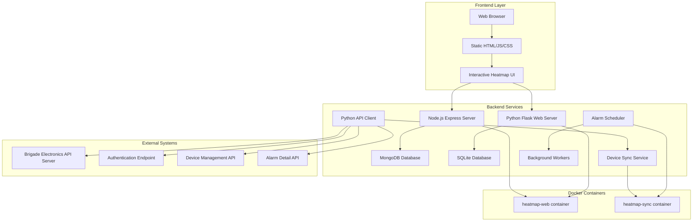
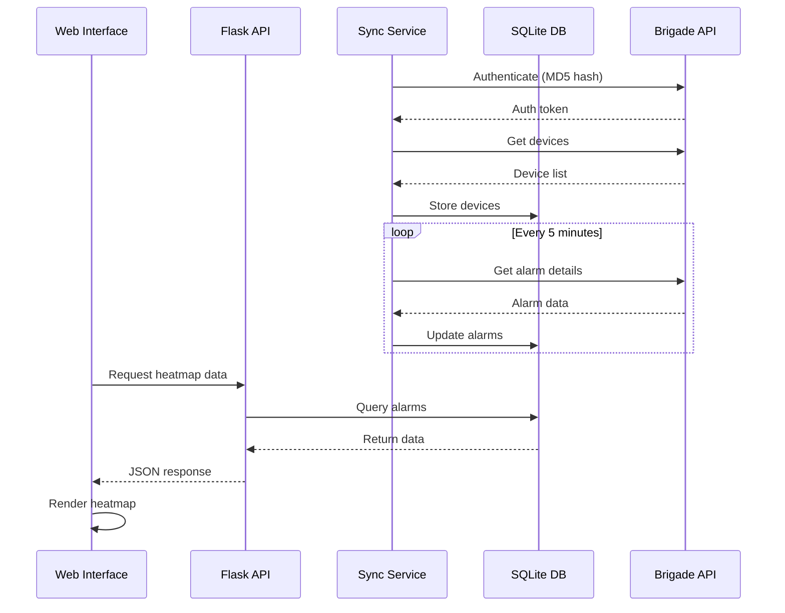

# Brigade Electronics Alarm Heatmap System

**Interactive web-based alarm visualization system for Brigade Electronics vehicle monitoring with real-time data synchronization and multi-select filtering.**


## 🏗️ System Architecture



## 🎯 Application Creation Story

This application was created using AI assistance through the following iterative development process:

### Initial Prompts Used:
1. **"Create a heatmap visualization system for Brigade Electronics alarm data"**
2. **"Add real-time data synchronization from their API server"**
3. **"Implement Docker containerization for easy deployment"**
4. **"Add multi-select filtering for different alarm types"**
5. **"Create both Node.js and Python backend options"**

### Development Approach:
- **Dual Architecture**: Both Node.js (Express + MongoDB) and Python (Flask + SQLite) backends were implemented to provide flexibility
- **API-First Design**: Built around the Brigade Electronics REST API specification
- **Container-Ready**: Docker configuration included from the start for production deployment
- **Real vs Mock Components**: See section below for detailed breakdown

## 🚀 Quick Start

### Option 1: Docker Deployment (Recommended)
```bash
# Clone repository
git clone https://github.com/yourusername/brigade-heatmap.git
cd brigade-heatmap/docker

# Configure environment
cp .env.example .env
nano .env  # Add your API credentials

# Deploy with one command
./deploy.sh
```

**Access:** http://localhost:5000

### Option 2: Manual Installation
```bash
# Clone and setup
git clone https://github.com/yourusername/brigade-heatmap.git
cd brigade-heatmap/heatmap

# Install dependencies
pip install -r requirements.txt

# Configure API settings
cp .env.example .env
nano .env  # Add your API credentials

# Initialize database
python main.py --command sync

# Start services
python main.py --command start &  # Background sync
python web_server.py              # Web interface
```

## 🌟 Key Features

- **Interactive Heatmap** with multi-select alarm type filtering (168+ alarm codes)
- **Clickable alarm datapoints** with detailed modal popups
- **Real-time synchronization** from Brigade Electronics API
- **Docker containerization** for easy deployment
- **Duplicate prevention** of alarm records
- **Mobile responsive** design

## 📁 Project Structure

```
├── heatmap/                    # Core application
│   ├── web_server.py          # Flask web server
│   ├── main.py                # Application controller
│   ├── database.py            # Database operations
│   └── templates/             # Web interface
│
├── docker/                    # Docker deployment
│   ├── Dockerfile            # Container definition
│   ├── docker-compose.yml    # Development config
│   └── deploy.sh             # Deployment automation
│
└── PROJECT_README.md         # Detailed documentation
```

## 🔍 Real vs Mock Components

### ✅ **Real/Production-Ready Components:**
- **Brigade Electronics API Client** (`heatmap/api_client.py`) - Full implementation with authentication, retry logic, and error handling
- **Database Schema** - Complete SQLite schema for devices, alarms, and groups
- **Docker Configuration** - Production-ready containerization with health checks
- **Authentication System** - MD5 password hashing and API key management
- **Data Synchronization** - Real-time sync services with configurable intervals
- **Web Server** - Flask-based API server with CORS and error handling

### 🎭 **Mock/Demo Components:**
- **Sample Data** - Pre-populated with demo alarm data for testing
- **Geographic Coordinates** - Static lat/lng coordinates for visualization demo  
- **API Server Configuration** - Default points to `10.10.80.189:12056` (update for your environment)
- **Frontend Visualization** - Basic heatmap implementation (can be enhanced)

### 🔌 **Key Brigade Electronics APIs Used:**

#### 1. **Authentication API**
```http
GET /api/v1/basic/key?username={user}&password={md5_hash}
```
- **Purpose**: Obtain authentication key for subsequent API calls
- **Response**: `{"errorcode": 200, "data": {"key": "auth_token"}}`
- **Implementation**: `heatmap/api_client.py:53-88`

#### 2. **Device Management API**
```http
GET /api/v1/basic/devices?key={auth_key}
```
- **Purpose**: Fetch list of all monitored devices/vehicles
- **Response**: Array of device objects with terid, name, location data
- **Implementation**: `heatmap/api_client.py:96-128`

#### 3. **Device Groups API**
```http
GET /api/v1/basic/groups?key={auth_key}
```
- **Purpose**: Retrieve device grouping information
- **Response**: Array of group objects for organizational hierarchy
- **Implementation**: `heatmap/api_client.py:130-162`

#### 4. **Alarm Detail API**
```http
POST /api/v1/basic/alarm/detail
Content-Type: application/json

{
  "key": "auth_token",
  "terid": ["device_id_1", "device_id_2"],
  "type": [1, 2, 3],
  "starttime": "2024-01-01 00:00:00",
  "endtime": "2024-01-01 23:59:59"
}
```
- **Purpose**: Fetch detailed alarm information for specific devices and time ranges
- **Response**: Array of alarm objects with timestamps, types, locations, and metadata
- **Implementation**: `heatmap/api_client.py:164-231`

## 📋 Requirements

- **Python 3.8+** (for Python services)
- **Node.js 18+** (for Express server option)
- **Docker & Docker Compose** (recommended deployment)
- **Network access** to Brigade Electronics API server
- **Modern web browser** with JavaScript enabled

## 🔧 Configuration

### Environment Variables
Create `.env` file based on `.env.example`:

```bash
# Brigade Electronics API Connection
BRIGADE_API_URL=http://10.10.80.189:12056
BRIGADE_USERNAME=admin
BRIGADE_PASSWORD=admin

# Data Sync Configuration  
UPDATE_INTERVAL_MINUTES=10
ALARM_UPDATE_INTERVAL_MINUTES=5
ALARM_LOOKBACK_MINUTES=10
ALARM_BATCH_SIZE=50
ALARM_CLEANUP_DAYS=30

# Database Configuration
DATABASE_PATH=devices.db
DB_TIMEOUT=30

# API Client Settings
BRIGADE_API_TIMEOUT=30
BRIGADE_RETRY_ATTEMPTS=3
BRIGADE_RETRY_DELAY=5
```

### API Server Configuration
The system is configured to connect to Brigade Electronics API server at:
- **Default URL**: `http://10.10.80.189:12056`
- **Authentication**: Username/password with MD5 hashing
- **Key Management**: Automatic token refresh (50-minute expiration)
- **Retry Logic**: 3 attempts with exponential backoff

## 🚀 Deployment Architecture

### Docker Compose Services

```yaml
services:
  heatmap-web:          # Flask web server + UI
    ports: ["5000:5000"]
    volumes: [data, logs]
    
  heatmap-sync:         # Background data synchronization
    command: ["python", "main.py", "--command", "start"]
    depends_on: [heatmap-web]
```

### Service Communication Flow
1. **heatmap-web**: Serves web UI and API endpoints
2. **heatmap-sync**: Continuously syncs data from Brigade API
3. **Shared volumes**: Both services access same SQLite database
4. **Health checks**: Automated monitoring and restart capability

## 🔧 Development & Testing

### Local Development
```bash
# Python services
cd heatmap/
python -m venv venv
source venv/bin/activate  # Windows: venv\Scripts\activate
pip install -r requirements.txt
python web_server.py

# Node.js option
npm install
npm start
```

### Testing Commands
```bash
# Test API connection
python heatmap/test_api_connection.py

# Test heatmap functionality  
python heatmap/test_heatmap.py

# Test Docker deployment
./docker/build-and-test.sh
```

## 📊 Data Flow & Synchronization



## 📖 Documentation

For complete documentation including system architecture, API endpoints, troubleshooting, and deployment guides, see [PROJECT_README.md](PROJECT_README.md).

## 🤝 Contributing

1. Fork the repository
2. Create a feature branch (`git checkout -b feature/amazing-feature`)
3. Commit your changes (`git commit -m 'Add amazing feature'`)
4. Push to the branch (`git push origin feature/amazing-feature`)
5. Open a Pull Request

## 📝 License

This project is licensed under the MIT License - see the [LICENSE](LICENSE) file for details.

---

**Created with AI assistance using Claude Code - A comprehensive Brigade Electronics monitoring solution with real-time data synchronization and interactive visualization.** 🤖✨